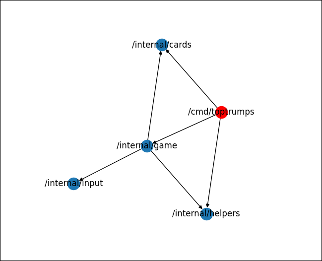
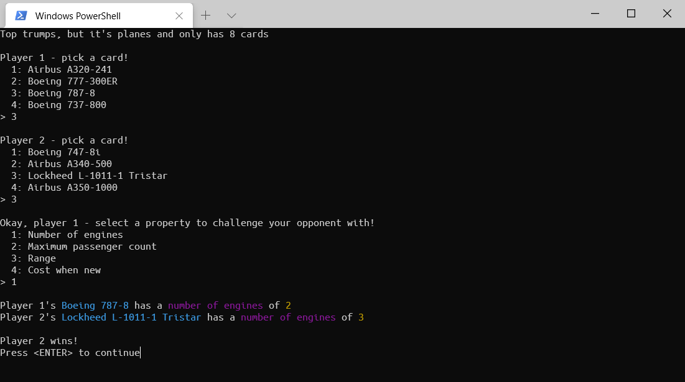

# Top Trumps

Golang 1.15, `github.com/codemicro/cs-toptrumps`, 249 lines of code

#### To build

```bash
git clone https://github.com/codemicro/cs-toptrumps
cd ./toptrumps
go generate github.com/codemicro/cs-toptrumps/internal/cards
go build github.com/codemicro/cs-toptrumps/cmd/toptrumps
```

#### To run

```bash
sudo chmod +x ./toptrumps
./toptrumps
```

## Contents

* What is Top Trumps?
* Success criteria
* Project structure
* Assorted components
  * Clearing the console
  * Collecting input
* Card logic
  * Defining the `Card` type
  * Loading cards
  * Dealing cards
* Game logic
  * Defining the `Game` type
  * The game loop
* The entry point
* What could be improved?
* Evaluation

## What is Top Trumps?

Top Trumps is a card game that is usually played between two players. Each set of the game contains a deck of cards, each with an individual name, and usually four or five attributes. These cards all follow a consistent theme across the entire deck, for example, about TV shows like Top Gear or Disney characters.

Players take turns to choose an attribute from the top-most card in their hand, which they compare to the same attribute on all the other players' cards. The player with the highest value for that one attributes gets to keep all the other players' cards. 

This continues until one player has all the cards in the deck in their hand, at which point they become the victor.

My game, while it follows the same sort of high level idea, functions slightly differently. Instead of just taking the first card in their hand, players get to choose their card. They also won't get to see values of attributes of their cards before selecting one to compare with.

When one player runs out of cards, they are declared the loser. The player who took their last card is declared the winner, and all other players (if there are any) are ignored.

## Success criteria

The program should:

* have a master set of cards that can be defined as JSON and parsed
* randomly create evenly sized decks of cards for each player
* be built in such a way that it should be possible to increase the number of players playing the game by changing one constant
* be able to transfer specific cards between players
* provide feedback on which card won out of all those selected

## Project structure

The vast majority of the code in this project is stored in packages in the `/internal` directory, which contains the following packages:

* `game`: contains logic related to playing the game.
* `helpers`: contains miscellaneous functions used in various places around the program
  * For example, functions to clear the console
* `input`: contains functions to collect input from the user
* `cards`: contains logic and structs related to cards
  * For example, loading cards from JSON and dealing decks

Code is broken down into small functions where possible, to ensure that code is not duplicated and to make reusing code easier.

In order to prevent import loops, a package hierarchy is in place: the `main` package (seen below as `/cmd/toptrumps`) imports the `game` package, which imports `cards`, `input` and `helpers`. Those packages cannot import from `game` as that would cause an import loop, but they could import from each other if needed. The import graph of the project ended up looking like this:



## Assorted components

### Clearing the display

During the game, it will be necessary to clear the console periodically to prevent it becoming cluttered.

Unlike in C# and other languages, Go has no built in method to do this. If we want to clear the console, we have to write a function that manually calls the system command.

```go
package helpers

// ...

func ClearConsole() {
	var cmd *exec.Cmd
	// Depending on the platform we're running on, we need to choose a different command.
	if runtime.GOOS == "windows" {
		cmd = exec.Command("cmd", "/c", "cls")
	} else {
		cmd = exec.Command("clear")
	}
	// The output of the command is set to the current command line that we're playing the game on.
	cmd.Stdout = os.Stdout
	_ = cmd.Run() // Run that command and ignore any errors
}
```

### Collecting input

During gameplay, multiple different types of input will have to be collected. To do this, we can write some functions to abstract a lot of the repetitive and fiddly logic, like validation, away.

```go
package input

// ...

var scanner = bufio.NewScanner(os.Stdin) // `scanner` is what will actually be used to get input

// Text prompts the user for a line of text, which it then returns.
func Text(prompt string) string {
	fmt.Print(prompt)
	scanner.Scan()
	return scanner.Text()
}

// Int prompts the user for an input, which is validated to ensure it is an integer, and then returns it as an integer
func Int(prompt string) int {
	for {
		n, err := strconv.ParseInt(Text(prompt), 10, 8) // Parse the string as a base-10, 8-bit number
		if err != nil {
			fmt.Println("Number is not an integer.")
		} else {
			return int(n) // strconv.ParseInt returns an int64, we must conver it to an int
		}
	}
}

// Options presents a collection of options to the user, and invites them to choose one. The index of that option and the option value are then returned.
func Options(prompt string, items []string) (int, string) {
	for {
		fmt.Println(prompt)
		for i, v := range items {
			fmt.Printf("  %d: %s\n", i+1, v)
		}
		num := Int("> ") - 1
		if !(num >= 0 && num < len(items)) {
			fmt.Println("Out of bounds")
		} else {
			return num, items[num]
		}
	}
}
```

## Card logic

### Defining the `Card` type

The first thing we need to do is define a `Card` struct to marshal our card definitions into so that we can use them in our program.

```go
package cards

// ...

type Card struct {
	Name string

	NumEngines int `readable:"Number of engines"`
	MaxPax     int `readable:"Maximum passenger count"`
	Range      int `readable:"Range"`
	Cost       int `readable:"Cost when new"`
}
```

You may have noticed that our struct has extra data attached to each attribute. This is called a *struct tag*, and it's a feature built into the Go language.

> A struct tag for an attribute allows you to attach metadata to the attribute which can be acquired using reflection. Usually it is used to provide info on how a struct attribute is encoded to or decoded from  another format (or stored/retrieved from a database), but you can use it to store whatever metadata you want to, either intended for another  package or for your own use.
>
> - https://stackoverflow.com/a/30889373

In our case, we can use it to store the readable name of each attribute. This also means that if we wanted to add any new attributes in the future, we could do so easily without having to modify any code in the main game loop, since we will be only ever referencing values from our cards by struct tag values. To retrieve these values, we need to use reflection, as alluded to by the above explanation. To do this, we will attach a pair of methods to our struct.

```go
package cards

// ...

// GetReadableNames iterates all attributes of a given card `c`, and generates a slice of any struct tag that has the readable field set. This is slightly confusing to do, but works well.
func (c Card) GetReadableNames() (names []string) {
	ct := reflect.TypeOf(c)
	for i := 0; i < ct.NumField(); i += 1 {
		field := ct.Field(i)
		tag := field.Tag.Get("readable")
		if tag != "" {
			names = append(names, tag)
		}
	}
	return // equivalent to `return names`
}

// GetValueByReadable takes the readable name of an attribute and returns the value of that attribute, if it exists. This assumes that only integer values have `readable` tags attached to them. If an attribute that is not an integer is read from by this function, it will panic and crash the application.
func (c Card) GetValueByReadable(readable string) int {
	ct := reflect.TypeOf(c)
	for i := 0; i < ct.NumField(); i += 1 {
		tField := ct.Field(i)
		tag := tField.Tag.Get("readable")
		if tag == readable {
			cv := reflect.ValueOf(c)
			vField := cv.Field(i)
			return vField.Interface().(int) // The panic would occur here, when the generic interface{} type is asserted into an integer so it can be returned
		}
	}
	return 0
}
```

### Loading cards

Card information is originally defined in a `cards.json` file that looks like this:

```json
[
    {
        "Name":"Lockheed L-1011-1 Tristar",
        "NumEngines":3,
        "MaxPax":256,
        "Range":2680,
        "Cost":134160000
    },
    {
        "Name":"Airbus A340-500",
        "NumEngines":4,
        "MaxPax":310,
        "Range":9000,
        "Cost":297500000
    },
    {
        "etc": "etc"
    }
]
```

However, in order to make the game simpler for the user (so they don't have to worry about having specific files in the right place), we can bundle the contents of the `cards.json` file into our program at compile time. As a result, our game can be distributed as a single binary file, instead of multiple files that have to be in specific locations relative to each other.

There is currently no built in way to do this in Go, so we can use a tool called `go-bindata`. This works by generating Go code that contains the contents of our file contents and some helper functions to access it. Because `go-bindata` is a command line program, we can define the command that needs to be run in order to generate our code file using a `go:generate` directive.

Once this directive is defined, you can use the `go generate <pkgname>` command to run it. For example, to generate the code for the `cards` package, you could run `go generate github.com/codemicro/cs-toptrumps/internal/cards`.

This command must be run before the program is compiled, to properly update the cards.

The `go:generate` directive looks like this, and goes at the top of our `cards` package.

```go
package cards

// ...

//go:generate go-bindata -pkg cards cards.json
```

Since we have our `Card` struct completely set up, unmarshal our JSON into a slice of that type.

```go
package cards

// ...

var (
	AllCards   []Card
	AvailCards []Card // Like AllCards, but is modified when cards are removed from the deck
)

// init runs automagically on package initialisation (when the `cards` package is imported by another package)
func init() {
	// Load all card info from cards.json, which is a bundled file

	fCont := MustAsset("cards.json") // MustAsset is a function from the generated code

	err := json.Unmarshal(fCont, &AllCards) // Unmarshal into `AllCards`
	if err != nil {
		fmt.Println("Unable to load cards.json. Is the format correct?")
		panic(err) // This quits - we cannot continue with the game if we have no cards
	}

	AvailCards = AllCards
}
```

### Dealing cards

Finally, we can write two functions to deal with dealing (pun unintended) cards.

```go
package cards

// ...

// Deal will select n cards from the deck of available cards at random, remove them from that deck, and return them in a new mini-deck
func Deal(n int) (deck []Card) {
	r := rand.New(rand.NewSource(time.Now().UnixNano()))

	for i := 0; i < n; i += 1 {
		chosenIndex := r.Intn(len(AvailCards))
		deck = append(deck, AvailCards[chosenIndex])

		AvailCards = append(AvailCards[:chosenIndex], AvailCards[chosenIndex+1:]...) // Remove chosen card from available deck
		// The `...` syntax means thge items of that slice/array are used as arguments to the `append` function.
	}

	return
}

// SplitCards will create n decks, each of the same size, and return those. Cards returned are taken and removed from the deck of all available cards
func SplitCards(n int) (decks [][]Card) {
	numCards := len(AvailCards)

	// If there are less cards than there are decks to create, that's never going to work.
	// In the context of this program, this is only ever going to be caused by a programming error and not by anything that a user inputs. Because of this, we don't need to go to all the hassle of properly handling an error, and can instead just call panic and quit.
	if numCards < n {
		panic(fmt.Errorf("there are not enough available cards (have: %d) in order to create %d new deck(s)", numCards, n))
	}

	// While the number of cards in the deck doesn't divide evenly by the number of required decks, reduce the size of the pool of cards to select from
	for numCards%n != 0 {
		numCards -= 1
	}

	cardsPerDeck := numCards / n

	for i := 0; i < n; i += 1 {
		decks = append(decks, Deal(cardsPerDeck))
	}

	return
}
```

## Game logic

### Defining the `Game` type

Our game is going to be using a dedicated type to represent our game and to store variables only required within the game, as to not clutter the package namespace.

```go
package game

// ...

const NumPlayers = 2

type Game struct {
	decks               [NumPlayers][]cards.Card
	selectedCardIndexes [NumPlayers]int
	selectedCards       [NumPlayers]*cards.Card
	selectedProperties  [NumPlayers]int
}
```

To accompany this type, we create a `New` function that we can use to create a new instance of `Game`. This is required because the struct has unexported fields that can't be set outside of the `game` package.

```go
// New creates a new instance of `Game`, based on the decks provided.
func New(decks [][]cards.Card) *Game {

	g := new(Game)

	// `g.decks` is a fixed-length array, whereas the `decks` argument is a variable-length slice of decks. The easiest way turn this slice into the required array it just to iterate over it, adding elements as we go.
	// If there are less decks than the number of players, this will panic. This is acceptable, as (in the context of this program) this is only ever caused by a programming error, never by something the user has inputted. Were it something the  user did, proper error handling would be put in place.
	for i := 0; i < NumPlayers; i += 1 {
		g.decks[i] = decks[i]
	}

	return g
}
```

### The game loop

You'll notice that a lot of the code in this function is written using loops that iterate over the `NumPlayers` constant. Theoretically, the value of this could be changed, and the entire game loop would work as normal, just with a different number of players.

```go
package game 

// ...

// Run runs the game. Shocking, I know.
func (g *Game) Run() {

	// priorityPlayer is used to determine which player gets to choose the card property to compare with.
	// It's iterated and/or reset at the end of each round, and it corresponds to an index in the arrays found in the `Game` struct.
	priorityPlayer := 0

	for { // Infinite loop time!

		// Reset the `g.SelectedCards` array to blank. This is not always the case because it is not cleared at the end of a round.
		g.selectedCards = [NumPlayers]*cards.Card{}

		// ----- Ask each player which card they'd like to use out of all the ones in their deck -----

		for playerIndex := 0; playerIndex < NumPlayers; playerIndex += 1 {

			// Make a slice of strings to show to the user, to represent each card struct.
			var cardStrings []string
			for _, v := range g.decks[playerIndex] {
				cardStrings = append(cardStrings, v.Name)
			}

			selectedCard, _ := input.Options(fmt.Sprintf("Player %d - pick a card!", playerIndex+1), cardStrings)

			g.selectedCardIndexes[playerIndex] = selectedCard // this, while it works, it me being lazy and not wanting to do any searching later on in the round logic
			g.selectedCards[playerIndex] = &g.decks[playerIndex][selectedCard]

			fmt.Println()

		}

		// ----- Prompt the player with priority to select a property -----

		options := g.selectedCards[priorityPlayer].GetReadableNames()

		_, selectedOption := input.Options(fmt.Sprintf("Okay, player %d - select a property to challenge your opponent with!",
			priorityPlayer+1), options)

		fmt.Println()

		// ----- Gather values for each of those properties out of all selected cards -----

		for playerIndex, selectedCard := range g.selectedCards {

			propVal := selectedCard.GetValueByReadable(selectedOption)

			// au.<colour> functions only exist to give the output some funky colours with ANSI colour codes. They take a string in and return a string wrapped with the corresponding colour codes.

			fmt.Printf("Player %d's %s has a %s of %d\n", playerIndex+1, au.Cyan(selectedCard.Name),
				au.Magenta(strings.ToLower(selectedOption)), au.Yellow(propVal))

			g.selectedProperties[playerIndex] = propVal
		}

		// ----- Determine which player won -----

		var winningPlayerNumber int

		{ // These curly brackets are here to scope a load of random, temporary variables to this section of the logic, as to not pollute the namespace elsewhere in the app.
			var selectedPropCopy []int
			for i := 0; i < NumPlayers; i += 1 {
				selectedPropCopy = append(selectedPropCopy, 0)
			}

			copy(selectedPropCopy, g.selectedProperties[:])
			sort.Ints(selectedPropCopy)

			lastIndex := len(selectedPropCopy) - 1

			if selectedPropCopy[lastIndex] == selectedPropCopy[lastIndex-1] {
				winningPlayerNumber = -1
			} else {
				for i, v := range g.selectedProperties {
					if selectedPropCopy[lastIndex] == v {
						winningPlayerNumber = i
						break
					}
				}
			}
		}

		fmt.Println()

		if winningPlayerNumber == -1 {
			fmt.Println("There was a draw!")
		} else {
			fmt.Printf("Player %d wins!\n", winningPlayerNumber+1)

			// Give the winning player all the losing players' cards

			for i := 0; i < NumPlayers; i += 1 {
				if i != winningPlayerNumber {
					// Code like this is code that I can write really easily when I have a crystal clear mental model of the data structures involved, and code that I can't do anything with after I initially wrote it because I have no idea what the hell is going on
					g.decks[winningPlayerNumber] = append(g.decks[winningPlayerNumber], *g.selectedCards[i])
					g.decks[i] = append(g.decks[i][:g.selectedCardIndexes[i]], g.decks[i][g.selectedCardIndexes[i]+1:]...)
				}
			}

			// Check to see if the other player still has any cards left

			for i, deck := range g.decks {
				if len(deck) == 0 {

					var playerWithMostCards int
					{
						var highestCardCount int
						for x, deck := range g.decks {
							if len(deck) > highestCardCount {
								highestCardCount = len(deck)
								playerWithMostCards = x
							}
						}
					}

					fmt.Printf("\n     -----\nPlayer %d has run out of cards! The winner is player %d, as they have the most cards.\n", i+1, playerWithMostCards+1)

					return
				}
			}

		}

		fmt.Printf("Press <ENTER> to continue")
		fmt.Scanf("dfkjghkh") // I don't quite know why it needed a string of random characters here, but it made it work so I'm just going to back away slowly and leave it alone

		helpers.ClearConsole()

		priorityPlayer += 1
		if priorityPlayer == NumPlayers {
			priorityPlayer = 0
		}

	}
}
```

## The entry point

With all the rest of the code completed, all we now need is an entry point. This is the job of the `main` function, in the `main` package.

```go
package main

// ...

func main() {

	helpers.ClearConsole()

	fmt.Printf("Top trumps, but it's planes and only has %d cards\n", len(cards.AllCards))
	fmt.Println()
	time.Sleep(time.Second)

	g := game.New(cards.SplitCards(game.NumPlayers))
	g.Run()
}
```

And with that, our program is complete!



## What could be improved?

* A points-based storing system could be added, instead of just the cards being added or removed from a player's deck
* Colours could be used more consistently throughout the entire program 
* The program could be re-written with a HTML/CSS/JS user interface bundled into one executable file in order to give the game a GUI
* A way for users to add their own card definitions

## Evaluation

The program should:

* have a master set of cards that can be defined as JSON and parsed
  * This has been met
* randomly create evenly sized decks of cards for each player
  * This has been met
* be built in such a way that it should be possible to increase the number of players playing the game by changing one constant
  * This has theoretically been met, but not tested
* be able to transfer specific cards between players
  * This has been met, and implemented when cards are swapped between players' decks
* provide feedback on which card won out of all those selected
  * This has been met
